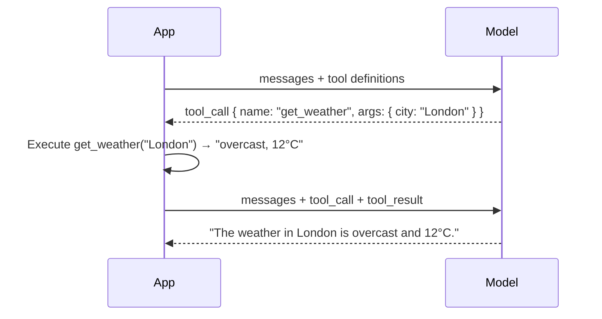

# Tool Calling

## 🎓 Learning objectives

By the end of this section, you will:

- Understand why models need tools and what they can do
- Know the request-response flow of a tool call
- Implement an agentic loop in code that handles tool execution

---

## 🔨 Why models need tools

A language model only knows what was in its training data — it has no access to real-time information, external systems, or the ability to take actions. **Tools** solve this problem.

Tools are functions you define that the model can *request* the application to run. The model doesn't run them itself — it tells you *what* to run and *with what arguments*. Your application executes the tool and sends the result back to the model.

Tools can do almost anything:
- Fetch real-time data (weather, stock prices, database queries)
- Search the web or internal knowledge bases
- Call external APIs or services
- Write files, send messages, trigger workflows

---

## 🔁 The tool calling flow

When you include tool definitions in your API request, the model may respond with a tool call instead of a text answer:



This back-and-forth is called an **agentic loop** — the application keeps sending messages until the model produces a final text response.

---

## 🧪 Seeing tool calling in the Visual Chatbot

The Visual Chatbot lets you step through each part of the tool calling flow manually.

1. Open the :tabLink[Visual Chatbot]{id="chatbot" href="http://localhost:3050"} and reset messages.

2. Open **Settings > System prompt**, paste the following, and save:

    ```plaintext
    You are a helpful, concise weather assistant. Use the available tools to answer weather questions accurately. Assume the user does not see tool results directly — include the data in your final response.
    ```

3. Add a user message and send it:

    ```plaintext
    What is the current time in Tokyo?
    ```

    The model will likely give an inaccurate or apologetic answer — it doesn't have access to real-time data.

4. In the **Tools** tab in the right sidebar, click **+ Add time tool**.

    This registers a `get-current-time` tool with the model. Click on the tool name to see its `description` and `parameters` — these are what gets sent to the model.

5. Add another message and send it:

    ```plaintext
    What time is it in Tokyo right now?
    ```

    This time you should see a **Tool execution request** in the chat. The model decided it needed the time tool and returned a structured request instead of a text answer.

6. Click **Invoke tool** to execute the tool. Your app sends the result back to the model as a `tool` message.

7. Click **Send messages to model** to let the model generate its final response using the tool result.

> [!IMPORTANT]
> The model **requests** tools; your application **executes** them. This separation is intentional — it lets you validate, log, rate-limit, or even reject tool calls before execution.

---

## 👩‍💻 Implementing the agentic loop in code

Now you'll build the agentic loop yourself. The starter file has all the tool definitions and mock implementations ready — your job is to complete the loop.

1. Open the :fileLink[`03-tools/index.js`]{path="03-tools/index.js"} file.

    Read through the file. The tools (`get_weather` and `get_temperature`) and their definitions are already written. The `chat()` function has a skeleton — you'll complete the agentic loop inside it.

2. Inside the `chat()` function, replace the `// TODO: Add the agentic loop here` comment with the following:

    ```javascript
    while (true) {
        const response = await openai.chat.completions.create({
            model: MODEL,
            messages,
            tools: toolDefinitions,
            tool_choice: "auto"
        });

        const choice = response.choices[0];
        const message = choice.message;

        // Always add the model's message to history
        messages.push(message);

        // If the model is done, return the final answer
        if (choice.finish_reason === "stop") {
            console.log(`Assistant: ${message.content}`);
            return message.content;
        }

        // If the model wants to call tools, execute each one
        if (choice.finish_reason === "tool_calls" && message.tool_calls) {
            for (const toolCall of message.tool_calls) {
                const name = toolCall.function.name;
                const args = JSON.parse(toolCall.function.arguments);

                console.log(`  [Tool call] ${name}(${JSON.stringify(args)})`);
                const result = toolImplementations[name](args);
                console.log(`  [Tool result] ${result}`);

                // Send the result back as a tool message
                messages.push({
                    role: "tool",
                    tool_call_id: toolCall.id,
                    content: String(result)
                });
            }
        }
    }
    ```

3. Install dependencies and run the app:

    ```bash terminal-id=tools
    cd 03-tools && npm install
    ```

    ```bash terminal-id=tools
    node index.js
    ```

    You should see the tool calls logged as they happen, followed by the model's final answer incorporating the results.

> [!NOTE]
> Small models like Llama 3.2 3B don't always invoke tools reliably — they may sometimes answer without calling a tool, or call tools incorrectly. Larger models (GPT-5, Claude, Gemini, etc.) are significantly more reliable for tool calling in production.

> [!TIP]
> Try adding a third tool — for example, `get_humidity` — and adding its definition to `toolDefinitions`. Then ask a question that should trigger it.
