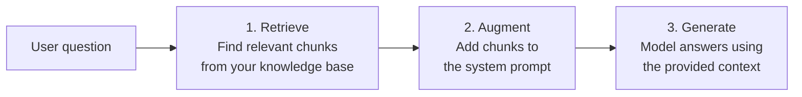

# RAG: Grounding Models in Your Data

## 🎓 Learning objectives

By the end of this section, you will:

- Understand why RAG is necessary and when to use it
- Know the three stages of a RAG pipeline: retrieve, augment, generate
- Build a working RAG system that answers questions from a knowledge base

---

## 🤔 The problem: models don't know your data

Language models are trained on public internet data with a knowledge cutoff date. They don't know:

- Your company's internal policies
- Your product's documentation
- Events that happened after their training cutoff
- Any private or proprietary data

You could include all this data in the system prompt — but context windows have limits, and sending thousands of pages on every request is expensive and slow.

**Retrieval-Augmented Generation (RAG)** solves this by finding only the *relevant* pieces of your data and including those in the prompt.

---

## 📚 The RAG pipeline

RAG has three stages:



**Stage 1 — Retrieve:** Given the user's question, search your knowledge base for relevant text chunks. In production this usually uses **embeddings** (vector representations of text) and semantic similarity search. For this lab, we'll use keyword search to keep things focused on the concept.

**Stage 2 — Augment:** Inject the retrieved chunks into the system prompt as additional context.

**Stage 3 — Generate:** The model generates its response using only the provided context. By instructing it to only use the context (and say "I don't know" otherwise), you prevent hallucinations.

> [!NOTE]
> **Embeddings** convert text into numerical vectors that capture semantic meaning. Similar concepts end up with similar vectors, so a vector search for "time off work" would match a document about "PTO and vacation policy" even without exact keyword overlap. Production RAG systems almost always use embeddings for this reason.

---

## 🔬 Seeing the difference: with and without RAG

You'll run the same questions twice — once asking the model directly, and once with RAG — to see how much difference retrieved context makes.

1. Open the :fileLink[`04-rag/index.js`]{path="04-rag/index.js"} file and read through it.

    The file includes:
    - A `loadDocuments()` function that reads `.txt` files from the `documents/` folder
    - A `retrieve()` function that scores documents by keyword relevance
    - A skeleton `answerWithRAG()` function that you'll complete

2. Install dependencies:

    ```bash terminal-id=rag
    cd 04-rag && npm install
    ```

3. First, run it without your changes to see how the model answers **without** context:

    ```bash terminal-id=rag
    node index.js
    ```

    You'll see the model's direct answers to HR and product questions. Notice how it either doesn't know or gives generic answers.

4. Now complete the `answerWithRAG()` function. Replace the `// TODO` comment with:

    ```javascript
    // Step 1: Retrieve relevant document chunks
    const relevant = retrieve(question, documents);

    if (relevant.length === 0) {
        console.log("  No relevant documents found.\n");
        return "I don't have that information in my knowledge base.";
    }

    console.log(`  Retrieved ${relevant.length} chunk(s):`);
    relevant.forEach((doc, i) => {
        console.log(`    ${i + 1}. [${doc.title}] (score: ${doc.score})`);
    });

    // Step 2: Augment the prompt with the retrieved context
    const context = relevant
        .map(doc => `Source: ${doc.title}\n${doc.content}`)
        .join('\n\n---\n\n');

    // Step 3: Generate using the augmented prompt
    const response = await openai.chat.completions.create({
        model: MODEL,
        messages: [
            {
                role: "system",
                content: `You are a helpful assistant. Answer the question using ONLY the context below. If the answer is not in the context, say "I don't have that information in my knowledge base." Do not make up information.\n\nContext:\n${context}`
            },
            {
                role: "user",
                content: question
            }
        ]
    });

    return response.choices[0].message.content.trim();
    ```

5. Run the app again to see the difference:

    ```bash terminal-id=rag
    node index.js
    ```

    The RAG answers should now be specific and accurate, drawn directly from the documents in the `documents/` folder.

> [!IMPORTANT]
> The key to preventing hallucinations is the instruction: **"Answer using ONLY the context below."** Without this constraint, the model may blend its training knowledge with your context and produce plausible-sounding but incorrect answers.

---

## 🔎 Exploring the documents

Open the :fileLink[`04-rag/documents/`]{path="04-rag/documents"} folder to see the knowledge base used in this exercise. Try asking questions that span multiple documents, or add a new `.txt` file with your own content and ask questions about it.

> [!TIP]
> For production RAG systems, consider:
> - **Chunking strategy**: How you split documents affects retrieval quality. Sentence-level, paragraph-level, and sliding-window chunks all have trade-offs.
> - **Embedding models**: Semantic search finds documents that are *conceptually* similar, not just keyword-matching.
> - **Reranking**: After an initial retrieval pass, a reranker model scores chunks by relevance to the query for higher precision.
> - **Vector databases**: Purpose-built stores like pgvector, Weaviate, or Pinecone manage embedding storage and similarity search at scale.
